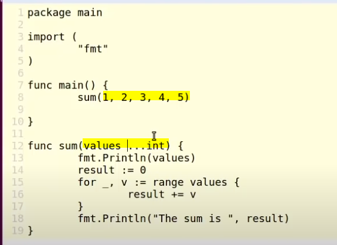
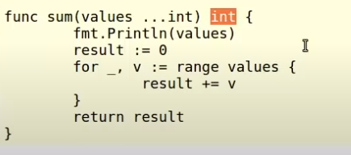
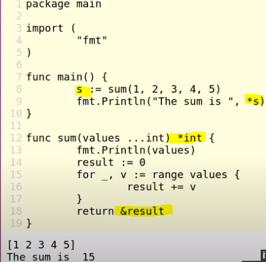
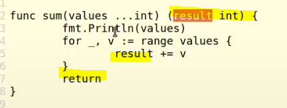
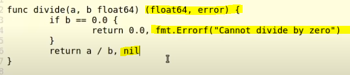
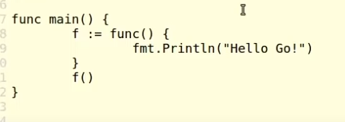
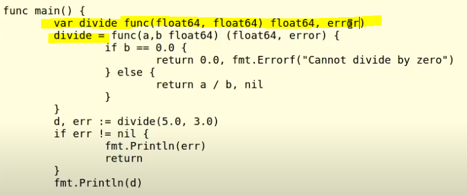
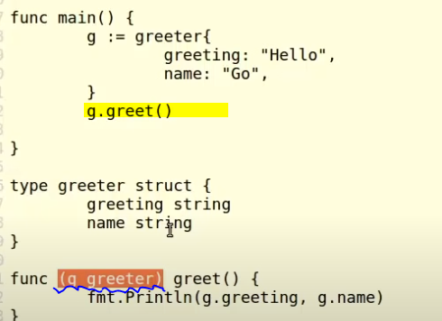

## [Jump to main page](./main.md)

# **FUNCTIONS**

- [**FUNCTIONS**](#functions)
  - [Creation & syntax](#creation--syntax)
  - [function as types & variables - functional like js / Ocaml](#function-as-types--variables---functional-like-js--ocaml)
  - [**METHODS**](#methods)

## Creation & syntax

- ```
  func main(){
    // process
  }
  ```
- `func` keyword
- The naming follows the same convention and rules as the variables

## parameters - almost the same as all other languages; copy by value

- ```
  func main(msg string, inx int){
    // process
    fmt.Println(msg)
  }
  ```
- Note that the parameter needs type delcaration
- Parameters of same type list type once
  - `func foo(bar, baz int){}`
- The parameters are passed down by value. What happens inside the function doesn't affect the outside. Except when it's address and when you change the values by dereferencing
  - It is much more efficient to pass values by pointer especially when it's a large data
  - Note that map and slices are both already referencing underlying data, so passing them down will be like passing down addresses
- ```
  greeting:="Hello"
  print(&gretting)    // print "Hi"
  fmt.Println(greeting) // this will print "Hi"
  func print(msg *string){
    // process
    *msg = "Hi"
    fmt.Println(msg)
  }
  ```

### **VARIADIC POINTER** - packing & unpacking

- `func foo(bar string, baz ...int){}`
  - barz will be a splice
- 
- The operation will pack the following variables in a slice and pass it down as a slice
- this has to be the **last** parameter

## return values

- To declare the return type: 

### Return local variable Golang allows the ability to **return a local variable as a pointer** (rare ability)

- 
- Different from other language where the function stack is destroyed after execution, the golang will save the value to the local stack from the function stack, so it will be accessible

### Name the return value in func declaration

- Name return value so when it reaches the return line, the named variable will be returned implicitly
  - 
- use `(varType1, varType2)` for multiple return values:
  - 
  - This can be used to avoid panicing.
  - If no error, `nil` is returned.

## **ANONYMOUS FUNCTIONS** - functional

- ```
  func main(){
    func(){
      fmt.Print("Hello Anonymous!")
    }()
  }
  ```
- You can passdown the parameters in the `()`
  - works well with asynchronous scenarios

## function as types & variables - functional like js / Ocaml

- 
- 
- Note that in this way, if you call the function fro above befor it's defined, then it will cause error
- You can pass down the function as a parameter in another function

## **METHODS**

- Methods are functions under certain context
- 
  - Notice there the type is declared before the function name
  - This can by any type (e.g. int)
- When calling `g.greet()`, the `greeter` created in the main function is going to be given the name `g`, therefore can have access within the struct obj
- This is copying by value and won't affect the value outside the method
- Same as the function parameter, the pointer is more tricky to work with. be aware :)

---

[Jump to main page](./main.md)
