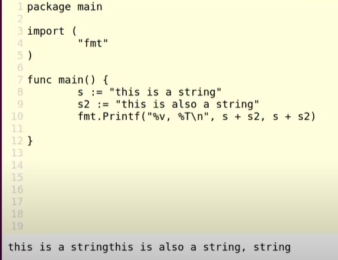
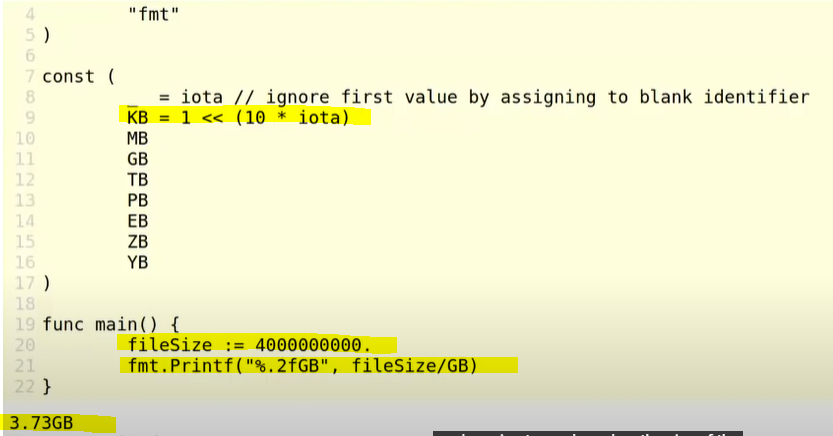

## [Jump to main page](./main.md)

# Primitive types, variables and constants

- [Primitive types, variables and constants](#primitive-types-variables-and-constants)
- [**PRIMITIVE TYPES**](#primitive-types)
  - [**BOOLEAN** - default value is 'false', not zero](#boolean---default-value-is-false-not-zero)
  - [**NUMERIC TYPES & OPERATIONS** - default value is 0; int, float and complex](#numeric-types--operations---default-value-is-0-int-float-and-complex)
    - [**Integers** - signed(8, 16, 32, 64); unsigned(8, 16, 32)](#integers---signed8-16-32-64-unsigned8-16-32)
    - [**Floats** - IEEE-754 standard; float(32, 64)](#floats---ieee-754-standard-float32-64)
    - [**Complex Number** - using float](#complex-number---using-float)
  - [Text types](#text-types)
    - [**STRING** - immutable, UTF8 character, an allias of Byte](#string---immutable-utf8-character-an-allias-of-byte)
    - [**RUNE** - UTF32 character, using '', alias of int32, need special package](#rune---utf32-character-using--alias-of-int32-need-special-package)
- [**VARIABLES**](#variables)
  - [Variable declaration](#variable-declaration)
  - [Redeclaration and shadowing, visibility](#redeclaration-and-shadowing-visibility)
  - [Naming Conventions](#naming-conventions)
  - [**Naming Conventions controls Visibility**](#naming-conventions-controls-visibility)
  - [Type conversions](#type-conversions)
- [**CONSTANTS**](#constants)
  - [Naming convention](#naming-convention)
  - [**TYPED CONSTANTS** - similar to typed variables, just aren't mutable](#typed-constants---similar-to-typed-variables-just-arent-mutable)
  - [**UNTYPED CONSTANTS** - rely on compiler's type inference, may have implicit conversion](#untyped-constants---rely-on-compilers-type-inference-may-have-implicit-conversion)
  - [**ENUMERATED CONSTANTS (IOTA) & ENUMERATION EXPRESSIONS** - similar to Java Enumerate type, more functional though; need to be available at compile time](#enumerated-constants-iota--enumeration-expressions---similar-to-java-enumerate-type-more-functional-though-need-to-be-available-at-compile-time)

# **PRIMITIVE TYPES**

## **BOOLEAN** - default value is 'false', not zero

- `var n bool = true`
- `var n bool = false`
- `n:= 1 == 1`
- `m:= 1 == 2` common use case
- everytime you initialize a variable in go, it actually has a zero value. The zero value for go is `false`, therefore by default it's false.
  - 
- Note that the boolean isn't using -1 and 0.etc like js does

## **NUMERIC TYPES & OPERATIONS** - default value is 0; int, float and complex

- the zero value is 0, or the 0 of the specific type

### **Integers** - signed(8, 16, 32, 64); unsigned(8, 16, 32)

- **signed int** of unspecified size (32 or 64 depending on system)
  - usually the default tpye
  - **int8** -128 ~ 127
  - **int16** -32768 ~ 32767
  - **int32** -2147483648 ~ 2147483647
  - **int64** -9223372036854775808 ~ 9223372036854775807
- **Unsigned int**
  - `var n uint16 = 42`
  - **unint8** 0 ~ 255
  - **int16** 0 ~ 65535
  - **int32** 0 ~ 4294967295
- built-in operations
  - `+, -, *, /, %`
  - note these are not changing the types implicitly without explicit conversion
- built-in bit-operators (similar to C++)
  - `&` AND
  - `|` OR
  - `^` exclusive OR
  - `&^` AND NOT
    - true if neighther of the bit has the bit set
  - Example 
- built-in bit-shifter (similar to C++)
  - `<<`
  - `>>`
  - Example 

### **Floats** - IEEE-754 standard; float(32, 64)

- IEEE-754 standard
- by default, initialzing symbol always use `float64`
- `float32` (+-)1.18E^-38 ~ (+-)3.4E^38
- `float64` (+-)2.23E^-308 ~ (+-)1.8E^308
- note that these needs conversion
- Creating floating numbers: allow the expression of e(float32) and E(float64)
  - 
- Operations
  - `+, -, *, /`
  - there is no reminder (`%`) operator

### **Complex Number** - using float

- `var n complex64 = 1 + 2i` -> float32 + float32
- `var n complex128 = 1 + 2i` -> float64 + float64
- Operations
  - `+, -, *, /`
  - To decompose the parts, there are two built-in functions
    - 
    - real() and imag()
  - To create Mega-complex number
    - 

## Text types

### **STRING** - immutable, UTF8 character, an allias of Byte

- In Go, it stands for any UTF8 character, and is an allias of Byte
- generally immutable
  - We usually can't change the character
  - 
- Note that String can't encode every type that's availabe
- It's similar to lower-level languages where it's treated like an array of characters
  - asking for the third letter directly, it will give back an integer(uint8): 
  - To get the string back, we need type conversion: 
- Operations
  - String concatenation
    - 
  - Converting to a collection of bytes (`byte slices`), which is more flexible
    - 

### **RUNE** - UTF32 character, using '', alias of int32, need special package

- a **true** type alias. When printing out the type, the type will be `int32`
- Represents an `UTF32` characters
- werid type, UTF32 can be up to 32 bits long, but not need to
- Declaration:
  - `r := 'a' ` Note that it uses single quote
  - 
  - It's an alias of int32, rather than a byte collection like string (rune===int32)
- use special functions from strings package from Golang

---

# **VARIABLES**

## Variable declaration

1. Declaring in a function
   - normal declarations & value assignment
     - `var i int`
     - variable i with type integer
     - Assign value by `i = 42`
   - Assign within the same line / full declaration
     - `var i int = 42`
   - **Short cut for decalaration and value assign**
     - `i:= 42`
     - note that we don't need `var` here, since go is doing both declaration and type inference
     - `j:= 42.` put a dot at the end if you need it to be float64. However it's not possible to initialize a float32 with this syntax
2. Declaring at package level
   - you have to use the full declaration `var i int = 42`
   - you can create a block of variables (like struct)
     - 
     - There can be multiple variable blocks. Better organization!

## Redeclaration and shadowing, visibility

- You are not allowed to redeclare a vairable twice in the same scope
  - 
- However it's allowed to shadowing. The declaration and value in the innermost scope is taking precidense

  - 

- All variables **MUST** be used. If you have a local variable that is declared but not used, that is a **compiled-time error**

## Naming Conventions

- Pascal or camelCase, and as short as reasonable
- basically, use meaningful name if the variable is going to be around for a while or it's going to be used outside of the package
- it's better to kep all acronyms in uppercase for readability
  - e.g. theUrl => `the URL`
  - e.g. theHttp => theHTTP

## **Naming Conventions controls Visibility**

- Naming controls visibility

- There are three levels of visibility in Go
  - package-level scope
    - **lower case variables** means that this variable is scoped to this package
    - everthing that's consuming the package can't see or work with it
  - global level scope
    - **upper case variables** means it's exported to this package, and it exposes this variable to the outside package
  - block scope
    - e.g. variable declared inside a function
    - never visible to the outside of the scope {}

## Type conversions

- similar to Java, usually there is no implicit type conversion. It's better practice to make type conversion explicit.
  - 
- note that there may be information lost during type conversion
  - `destinationType(variable)`
- Need to understand the string with Go when converting to String
  - 
  - in Go, the string is an allas for a string of bytes
  - in the screenshot, the conversoin is reads "asign value 4 to a type char" and 42 translates to "\*"
  - to convert into String, use `strconv` package
  - 

# **CONSTANTS**

- not allowed to change the values
- has to assignable at _compile time_.
  - E.g. you can't use Math.Sin(1.57) to assign a constant since the result is returned after execution

## Naming convention

- `const myConst` or `const MyConst` depending on whether you want to export the variables

## **TYPED CONSTANTS** - similar to typed variables, just aren't mutable

- similar to typed variables
- you can use any primitive type in Go
- `const myConst int = 42`
- note that collectoin types (e.g array) are inherently mutable, therefore you can't create constants with them.
- They can be shadowed both in value and type
  - 
- Operations are the same to primitive variables

## **UNTYPED CONSTANTS** - rely on compiler's type inference, may have implicit conversion

- use compiler's ability to infer the type for us
  - 
  - it will replace all instances of a
  - implicit conversion!

## **ENUMERATED CONSTANTS (IOTA) & ENUMERATION EXPRESSIONS** - similar to Java Enumerate type, more functional though; need to be available at compile time

- Most commonly applied at the package level
- `const a = iota`
- iota is a counter when we are creating a enumerate constant
- create a cont block, as it executes it will assign values to each variable
  - 
- if we stop assigning iota after the first one, the compiler is going to infer the pattern of assignment
  - 
- If we create other blocks, then they will start over with 0
  - 
- note that since it starts with 0, it may collide with the default value of int. To solve this:
  1. use the first iota as error value
     - 
  2. use `_` variable, the Golang only write-only variable
     - 
     - it means we don't care and throw it away after compilation, and don't use it
- It's actually allows primitive operation in const
  - 
  - it can change the offsset of the
- Math.exp() won't be availble at compile time. But if you want to do exponentional, you can do it by bit-shifting.
  - 
  - iota wil increment bytes as well

---

[Jump to main page](./main.md)
