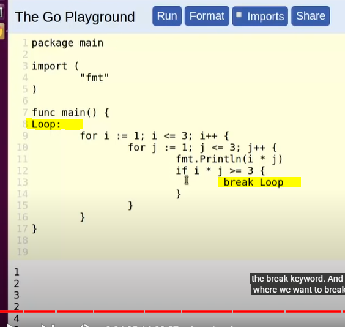

# **CONDITIONAL STATEMENTS**

- [**CONDITIONAL STATEMENTS**](#conditional-statements)
  - [**IF, IF ELSE, ELSE IF**](#if-if-else-else-if)
  - [**SWITCH STATEMENTS** - basically the same, but breaks are implied, and allows multiple cases on one branch](#switch-statements---basically-the-same-but-breaks-are-implied-and-allows-multiple-cases-on-one-branch)
    - [switch cases with **MULTIPLE TESTS** - each seperate case needs to be unique](#switch-cases-with-multiple-tests---each-seperate-case-needs-to-be-unique)
    - [**TAGLESS SYNTAX** - allowing comparison in switch](#tagless-syntax---allowing-comparison-in-switch)
    - [**FALLINGTHROUGH** - Bypass implied break](#fallingthrough---bypass-implied-break)
    - [**TYPE SWITCH**](#type-switch)
- [**COMPARISON VARIABLES** - normal](#comparison-variables---normal)
- [**LOGICAL OPERATORS** - normal](#logical-operators---normal)
- [Loop : **FOR statements**](#loop--for-statements)
  - [LABEL LOOP](#label-loop)
  - [FOR RANGE LOOP](#for-range-loop)

## **IF, IF ELSE, ELSE IF**

- You are not alloed to have single-line executions, you have to have {}
- Operators

  - ```
      if false {// execution if flase}
    ```
  - You can **directly use the result of functions**

    - Here, ok was passed and used as if condition 

- if-else
- else-if

## **SWITCH STATEMENTS** - basically the same, but breaks are implied, and allows multiple cases on one branch

- simple cases
  - 
- the target case is called a `tag`
- There is no 'break'. It's **implied**. So thoughtful. If you want to leave early, then you can still use this keyword

### switch cases with **MULTIPLE TESTS** - each seperate case needs to be unique

- Golang allows multiple cases in one switch branch
  - 
- Note that **the test cases must be unique**
- It is allowed to use functions on switch target

  - 

### **TAGLESS SYNTAX** - allowing comparison in switch

- When the tag case isn't there, you can switch using the comparison operators.etc
- It's allowed to overlap in range. The **first** case that's evaluated to true will be considered as success
- 

### **FALLINGTHROUGH** - Bypass implied break

- If you want to bypass the implied break, use `fallthrough` 
- It will fall to the next case and execute
- Note that `fallthrough` is **logicless**

### **TYPE SWITCH**

- Grab the type from the interface or whatever variable, and then we can use golang type to switch cases 

# **COMPARISON VARIABLES** - normal

- These does't work with String type or reference type
- `<, > ==, <=, >=, !=`
- floating variables and == don't get along

# **LOGICAL OPERATORS** - normal

- `&&, ||, !(not)`
- short circuiting: the sequence of evaluation matters. If it satisbfiys already then there is no need to look forward

# Loop : **FOR statements**

- 
- has **continue** and **break** keywords
- allow i++.etc
- simple loop

  ```
   for i:=0, i < 5, i++ {
     fmt.Println(i)
   }

  ```

- Golang allows to initialize multiple counters

  ```

  for i,j:=0, i < 5, i,j=i+1, j+1 {
    fmt.Println(i)
  }

  ```

- To i in the main function:

  ```
  i:=0
  for , i < 5, i, i++{
    fmt.Println(i)
  }

  ```

- missing the inrementer may cause infinite loop
- working collection with for loop

## LABEL LOOP

- By this syntax, you can label a loop and then brak by calling the label 

## FOR RANGE LOOP

- this works with **collections**, string, and **channels**
- loop through and get the individual values of a slice 
  - note: since go reuqires you to use all vairables, if you don't need k use \_ to replace it
- work with string 
  - notice that when printing out string it gives a unicode interpretation. To solve that type convert to string 
- Channel
  - used for concurrent programming
