## [Jump to main page](./main.md)

# Channels

- [Channels](#channels)
- [Basics](#basics)
  - [Creation](#creation)
  - [**Channel pauses goroutine right after data being put in, until there are more space inside the channel**](#channel-pauses-goroutine-right-after-data-being-put-in-until-there-are-more-space-inside-the-channel)
- [**Restricting and controlling data flow** - receive-only channel and send-only channels; using channel as goroutine input](#restricting-and-controlling-data-flow---receive-only-channel-and-send-only-channels-using-channel-as-goroutine-input)
- [**BUFFERED CHANNELS** - multiple inputs in channel & solve differences in frequency](#buffered-channels---multiple-inputs-in-channel--solve-differences-in-frequency)
- [**CLOSING CHANNEL** - disable sending or receiving](#closing-channel---disable-sending-or-receiving)
- [**for...range loops with channels** - extract data and ok status](#forrange-loops-with-channels---extract-data-and-ok-status)
- [**SELECT STATEMENTS** - switch statement only for channels](#select-statements---switch-statement-only-for-channels)
  - [Listening to channels](#listening-to-channels)
  - [With default option - non-blocking select statement](#with-default-option---non-blocking-select-statement)

# Basics

- usually used within goroutine
- it's the first-in-first-out data storage

## Creation

- `ch := make(chan int)`
- To read the channel: `<- ch`
- To input to a channel: `ch <- 24`
  - use make() function, chan keyword and the type of data
  - no te that the channel is strictly typed
- working with goroutine: 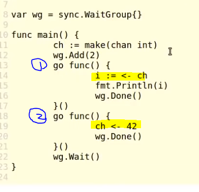
  - #1: goroutine to receive data from channel
  - #2: goroutine to put data into the channel
- When passing data into the channel, we are passing a copy of the value
  - 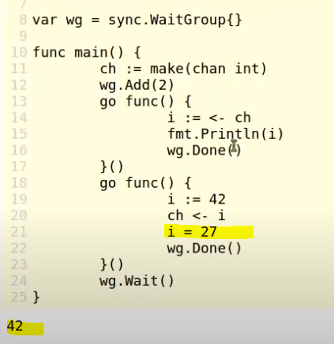
  - We can manipulate the variables after sending the value into the channel, it won't affect what's already in the channel.
- Example with multiple channels:
  - 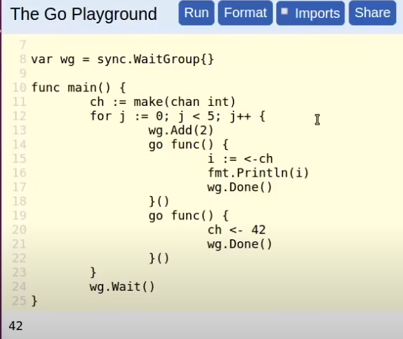
  - 5 "42" will be printed out
- However if you make the goroutines asymetrical, there will be a deadlock error. Reason is as followed:
- Special case: empty struct channel
  - `var doneCh = make(chan struct{})`
  - Strongly types to a struct with no fields.
  - Empty struct has 0 memory allocation. The only thing this channel cannot sent any data through except that signaling whether a message is sent or received, a **signal-only channel**
  - this is better than using boolean beause it requires no memory allocation
  - 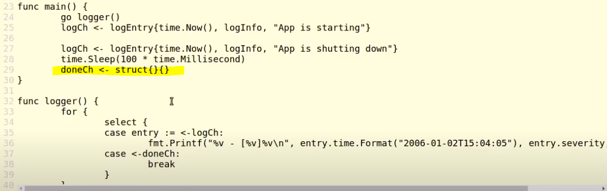

## **Channel pauses goroutine right after data being put in, until there are more space inside the channel**

- 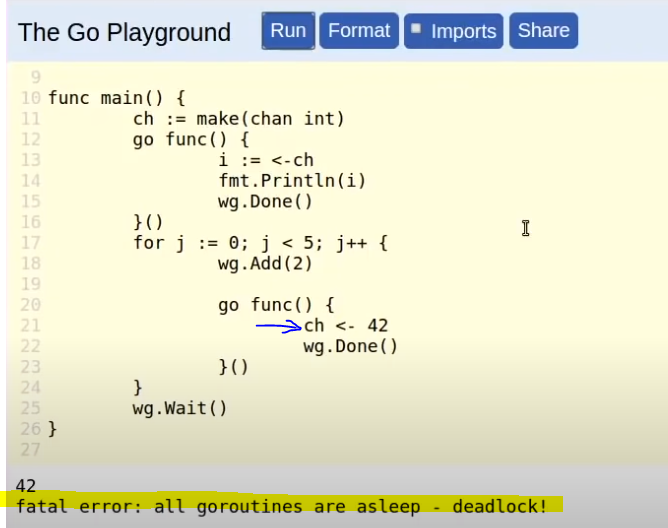
- this happens because the for loop is pushing messages into the channel, but there is nothing to receive or process them
- Channel pause goroutine right after data being put in, until there are more space inside the channel
- after one execution, since there is a new data pushed onto the channel on line21, the goroutine is paused, however there is no routine to process that channel.

# **Restricting and controlling data flow** - receive-only channel and send-only channels; using channel as goroutine input

- Passing **receive-only** channel `go func(ch <-chan int)`
  - In this case the channel won't be able to receive input inside the function
- Passing **send-only channel** `go func(ch chan<- int)`
  - In this case the channel won't be able to send to the function
- 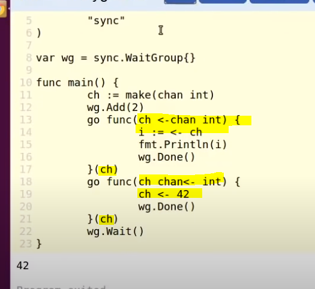
- note that we are using a bi-directional channel as uni-directional channel. It's a special case, and Go understands it.

# **BUFFERED CHANNELS** - multiple inputs in channel & solve differences in frequency

- Using like above works, however it runs into error when you want to pass two messages into the channel
  - 
- To solve this, add buffer to the channel `ch := make(chan int, 50)`
  - 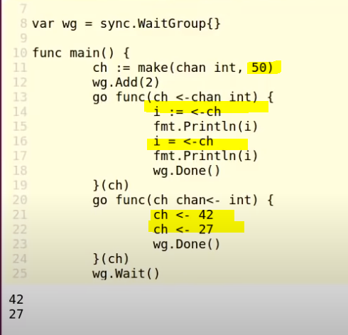
  - Also notice that we can get the second argument by a second `<-ch` call
- Buffered Channel is designed to solve the difference in frequency between different operations.

# **CLOSING CHANNEL** - disable sending or receiving

- `close(ch)`
- 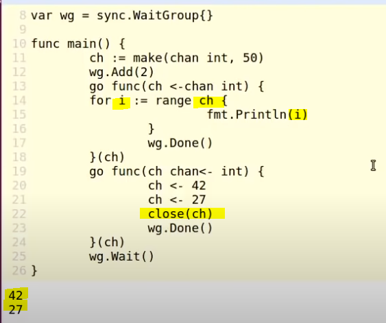
- In this example, line22 closes the channel, after which the range() function detects that the channel is closed therefore won't get the info from channel. If it's not closed, it will be a deadlock error
- Note that after your close the channel, you can't red or write the channel.
- You **can't** reopen the channel
- and the only way we would know that the channel is closed **when inputing** is to see if the program panics
  - To manually control this, you can extract the `ok` result of the channel looping
  - 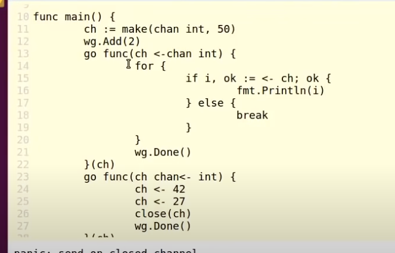
  - This syntax equals the range loop.

# **for...range loops with channels** - extract data and ok status

- The for...range loop reads the **value** inside the channel directly rather than index + value
- 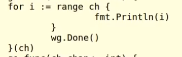
- underlying of for-range loop:
  - 

# **SELECT STATEMENTS** - switch statement only for channels

## Listening to channels

- 
  - This is where the empty channel receives signal
- 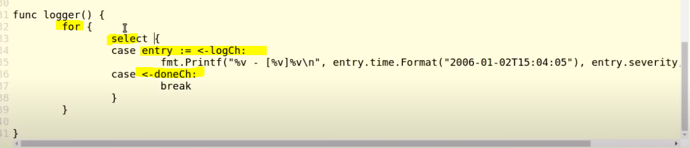
- the `select` statement is going to _block_ the loop, until one of the channels it's listening to receives an input
- The behavior is undefined if multiple channels receive value simultaneously
- After listening to the empty channel, and do whatever it needs to wrap up; e.g. kill the

## With default option - non-blocking select statement

- this no longer becomes a blocking statements.
- The default block will be executed if no channel that it's listening to has inputs

---

[Jump to main page](./main.md)
