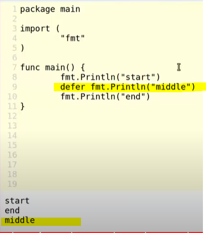
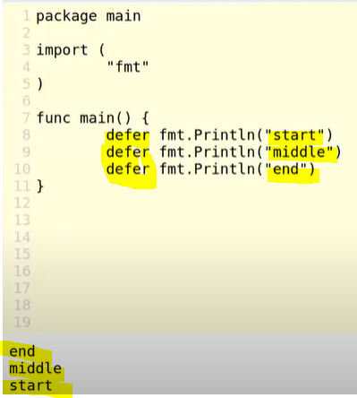
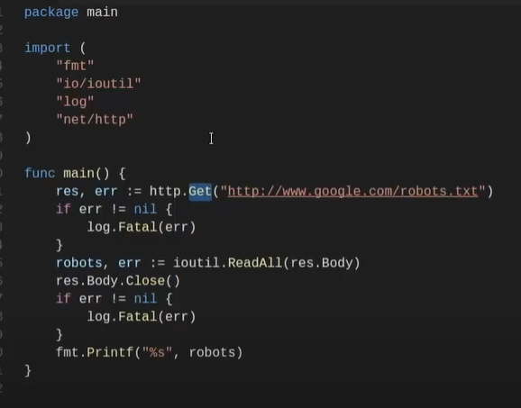
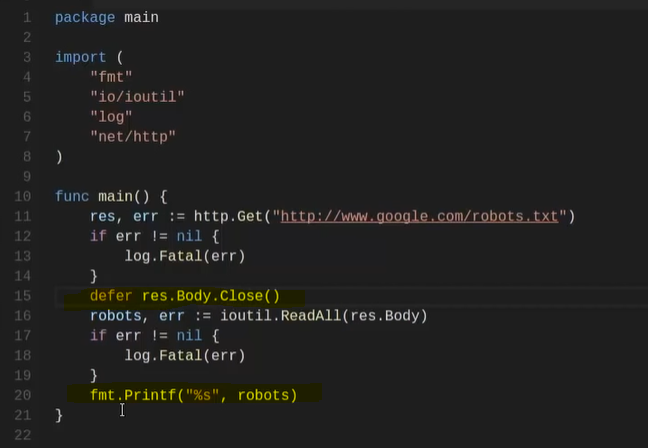
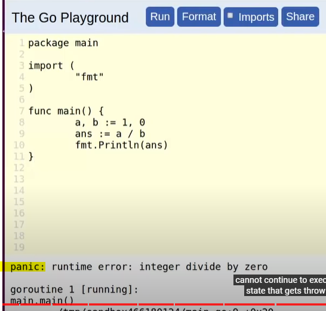
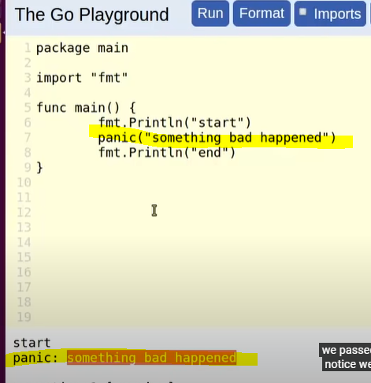
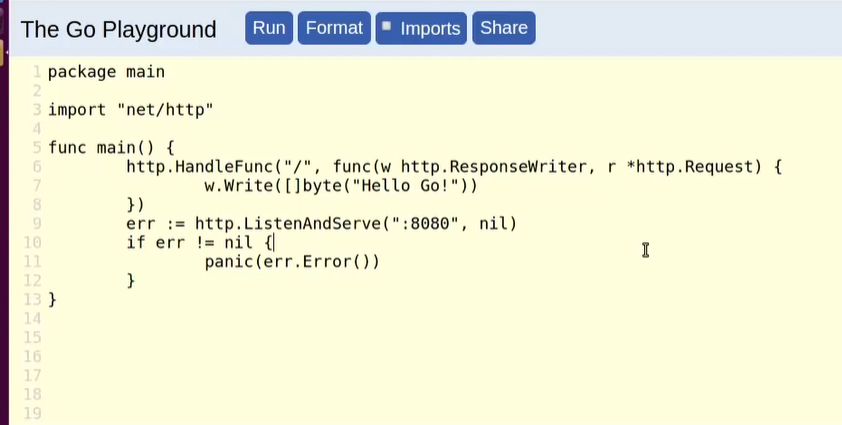
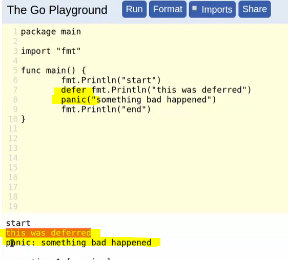
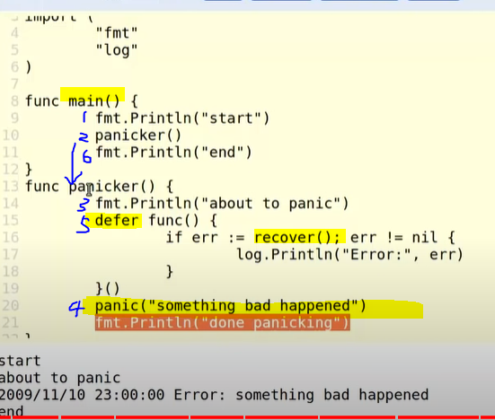
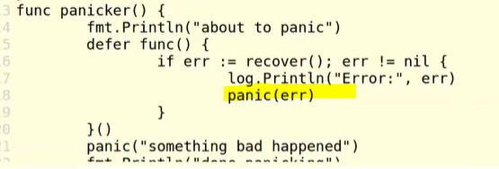

# **CONTROL FLOW** for function

- [**CONTROL FLOW** for function](#control-flow-for-function)
  - [**DEFER** - move the execution before return; useful for Open() and Close()](#defer---move-the-execution-before-return-useful-for-open-and-close)
  - [**PANIC** - go-version of exception; use for unrecoverable events](#panic---go-version-of-exception-use-for-unrecoverable-events)
  - [**RECOVER**](#recover)

## **DEFER** - move the execution before return; useful for Open() and Close()

- defer the execution
  - 
- executes the deferred function after the curent running function finishes its _final_ statement, but _before_ its actually returned
- deferred functions are executed in last-in order, so the last function deferred will be executed first
  - 
- we usually use defer keyword to _close out resources_, and in this order it won't be depending on previous values
- Example
  - 
  - in this example, the res.Body.Close() function is better of to being executed at the end after all possible usages has ended
  - 
- When the deferred function is executed, the function is actually going to take the value at the time the function was originally called
  - Before we defer the function, the value of a is preserved 
  - Q: is this by value or by reference?

## **PANIC** - go-version of exception; use for unrecoverable events

- 
- personalize the panic by `panic(STRING_TO_PRINT)`
  - 
  - This way the "end" won't be printed out since the function will be terminated
- A more practical exemple 
  - the server give error when the server is being blocked (e.g. when it's already being run on another terminal) 
  - by panic(err), it's sending the listener a message that it's not working as expected
- Note the order of execution 
  - order: 1. defer 1. Even if it's panicing, the deferred function is going to run 2. panic 3. return
  - It can be useful along with recover() 
    - note that the deferred function is an anonymous function invoked with ()
  - if you don't want to recover, just panic again
    

## **RECOVER**

- used to revofer panics
- **only useful in deferred functions** for panics
- current function will not attempt to continue, but higher functions in call stack will
