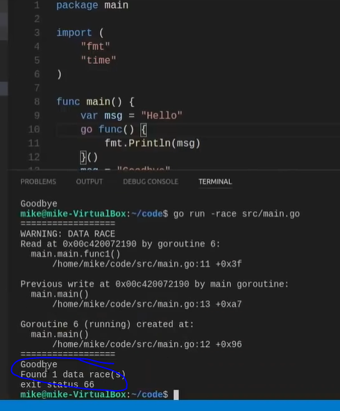

## [Jump to main page](./main.md)

# Goroutines - concurrent programming

- [Goroutines - concurrent programming](#goroutines---concurrent-programming)
- [Creating Go routines - creating **threads**](#creating-go-routines---creating-threads)
  - [**RACE CONDITION** - not good practice](#race-condition---not-good-practice)
  - [Sleep function is not generally recommended](#sleep-function-is-not-generally-recommended)
- [**SYNCHRONIZATION** - to avoid sleeping](#synchronization---to-avoid-sleeping)
  - [**WAITGROUPS**](#waitgroups)
  - [**MUTEXES** & **PARALLELISM**](#mutexes--parallelism)
  - [**runtime.GOMAXPROCS(num)**](#runtimegomaxprocsnum)
- [Best practices](#best-practices)
  - [Don't create goroutines in libraries](#dont-create-goroutines-in-libraries)
  - [wen creating a goroutine, know how it will end](#wen-creating-a-goroutine-know-how-it-will-end)
  - [check for race conditions at compile time - this is too nice of Go](#check-for-race-conditions-at-compile-time---this-is-too-nice-of-go)

# Creating Go routines - creating **threads**

- ```
  func main() {
      go sayHello()
  }

  func sayHello（） {
      fmt.Println("Hello")
  }

  ```

- The `go` command will ask the language to **spin-off a green thread, and run the sayHello function in the green thread**
- different from Java, we are going to create an abstraction of a thread which we called a `goroutine`
- there is a **scheduler** in runtime that will **map** these goroutines onto the operating system threads for periods of time.
- **Then the schedulers will take turn with every cpu thread that's available and assign the different goroutines a certain amount of processing time on those threads**
  - We don't need to interact with the low-level threads directly.
  - since they are abstract, goroutines can start with a very small stack
  - they are very _cheap_ to destroy. You can have thousands of goroutines at the same time without problems
- ```
  func main() {
      go sayHello()
  }

  func sayHello（） {
      fmt.Println("Hello")
  }

  ```

  - If we execute this, this will not print ou the string. This is because the function was executed in goroutine itself, and once `main` function is finished, it's done. There wans't enough time for the `sayHello` function to print out this message

- ```
  func main() {
      go sayHello()
      time.sleep(100 * time.Millisecond)
  }

  func sayHello（） {
      fmt.Println("Hello")
  }

  ```

  - now that the `main` function is delayed for 100 millisecond, the goroutine has enough time to print the message

## **RACE CONDITION** - not good practice

- **closure**: go-routine has access to higher-scope variables
- You don't need to use go to invoke a function:

  - ```
      func main(){
          var msg = "Hello"
          go func(){
              fmt.Println(msg)
          }()
          time.Sleep(100 * time.Millisecond)
      }

    ```

- we can use the `msg` outside of the goroutined function and use it inside.
- but this creates a dependency between the goroutine and the variable outside

  - ```
      func main(){
          var msg = "Hello"
          go func(){
              fmt.Println(msg)
          }()
          msg = "Goodbye"
          time.Sleep(100*time.Millisecond)
      }

    ```

  - now "Goodbye" will be printed out. This is not guaranteed to be the same behavior everytime.
  - **race condition** - The goroutine is not going to interrupt the main thread until it hits the `time.Sleep` function. So before go was run at `time.Sleep`, **the msg value has already been reassigned**. (not a good idea)

- to avois this, pass down the variable in the anonymous function. This can be trick if it's passing down an address, but usuall if we pass down the value it's generally working

  - ```
      func main(){
          var msg = "Hello"
          go func(msg string){
              fmt.Println(msg)
          }(msg)
          msg = "Goodbye"
          time.Sleep(100*time.Millisecond)
      }

    ```

## Sleep function is not generally recommended

# **SYNCHRONIZATION** - to avoid sleeping

## **WAITGROUPS**

- designed to synchronize go routines together
- 
  - 0 => initialize a waitgroup `wg`
  - 1 => `Add(1)` add one routine to be waited
  - 2 => `Wait()` wait for the goroutine to be executed
  - 3 => `Done()` deduct 1 routine from waitgroup
    - it will be down to 0 and execute
- This will take just enough time to finish all routines. This is much better than relying on machine time which is unstable
- But issue remains when there are many routines:
  - 
  - Result: 
    - There is no reliable behaviors. The go routines are racing against each other
    - there is no synchronization of goroutines
- To correct this, either make waitgroups for these, or use _mutex_

## **MUTEXES** & **PARALLELISM**

- a "lock" that the application is going to honor
  - lock & unlock
- protect part of our codes, so everytime only one thing can access the data at a time
- for goroutine, **We allow multiple reading at the same time, but we only allow one writing at one time**
  - writer will lock the resource
  - 
    - `m.RLock()` = lock reading lock
    - `m.RUnlock()` = release the reading lock
    - `m.Lock()` = lock the writing lock
    - `m.Unlock()` = unlock the writing lock
  - This is still not satisfying. If the `sayHello()` function is executed twice by its goroutine, and the incrementation functionisn;t called in-between, it will print consecutive numbers.
- we have to lock the mutext outside of the go-routine so it can be reliable. Goroutine itself can't control this.
- 
  - this is probably over-kill
  - this is not running parallel.etc, better remove goroutine lol

## **runtime.GOMAXPROCS(num)**

- it tells you how many operation system threads available now
- if num = -1, then it doesn't change the value of threads.
- sometimes it will be faster if you increase this value, but too high may be issue. better tune it in performance test.

# Best practices

- be careful

## Don't create goroutines in libraries

- let consumer contorl concurrency, unless it returns a channel

## wen creating a goroutine, know how it will end

- avoids subtle memory leaks
- if it's not stopped, it will continue forever

## check for race conditions at compile time - this is too nice of Go

- To test: `go run -race` command when running the go
- 

---

[Jump to main page](./main.md)
