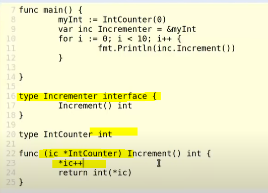
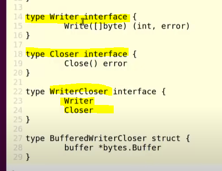
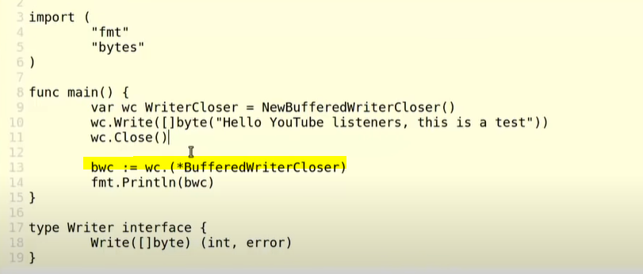
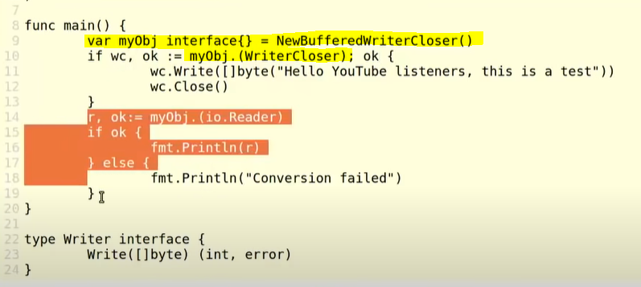
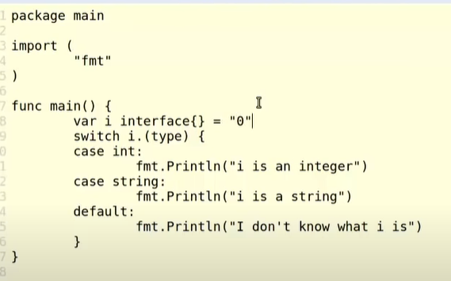
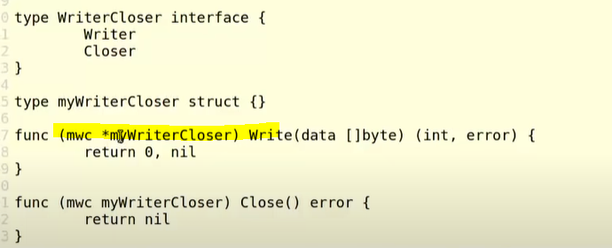
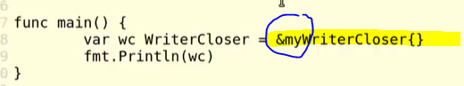
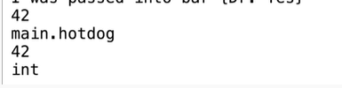
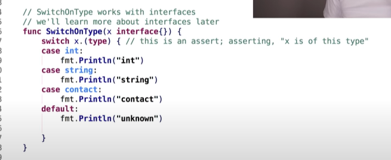
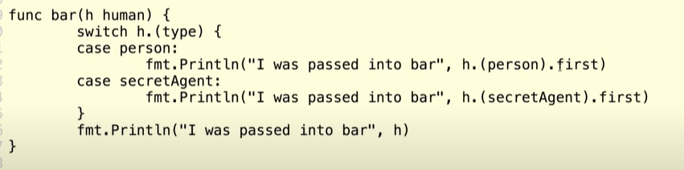

## [Jump to main page](./main.md)

# Interfaces

- [Interfaces](#interfaces)
- [Reading](#reading)
- [Basic - similar to that in Java](#basic---similar-to-that-in-java)
  - [Creation & implementation & **polymophic behavoir**](#creation--implementation--polymophic-behavoir)
  - [**IMPLICIT IMPLEMENTATION** - what makes it different from Java & bottom-up approach](#implicit-implementation---what-makes-it-different-from-java--bottom-up-approach)
  - [Naming convension](#naming-convension)
  - [It doesn't need to be a struct. Any custome type could be used](#it-doesnt-need-to-be-a-struct-any-custome-type-could-be-used)
- [**COMPOSING INTERFACES** - by embedding](#composing-interfaces---by-embedding)
  - [the empty interface](#the-empty-interface)
  - [**CONVERSION**](#conversion)
  - [**ASSERTION** - checking the cases by switch](#assertion---checking-the-cases-by-switch)
  - [Empty interface](#empty-interface)

# Reading

- [_Composition with Go_ by _William Kennedy_](https://www.ardanlabs.com/blog/2015/09/composition-with-go.html)

# Basic - similar to that in Java

## Creation & implementation & **polymophic behavoir**

- interfaces describe behaviors, not data

- Example

- ```

  // the inteface
  // same as function declaration but without a func keyword (input + return type)

  type Writer interface {
      Write([] btye) (int, error)
  }

  // implementation of concrete type Writer interface using struct

  type ConsoleWriter struct {}

  // method of struct
  func (cw ConsoleWriter) Write(data []byte) (int, error) {
    n, err := fmt.Println(string(data))
    return n, err
  }

  ```

- The `Writer` of ConsoleWriter does whatever it wants.
- The concept is the same as Java, that you only need to use the abstract type when you are declaring the function
- ```

  // here the it doesn't need to be the concrete type, just the interface "Writer"

  var w Writer = ConsoleWriter{}
  w.Write([]byte("Hello!"));

  ```

## **IMPLICIT IMPLEMENTATION** - what makes it different from Java & bottom-up approach

- The diffrence is that the language finds the interface by itself. It's more like a **bottom-up** behavior rather than top-down like the ones in Java.
- Like example above, you didn't actually 'declare' that the ConsoleWriter is of type Writer, instead you _implicitly_ said that it will behave like one
- the benefit of this: If you need to warp a concrete type in a interface, and somebody hasn't pulichsed the interface, you can create an interace that their type implements
  - e.g. you need a concrete SQL DB in a package, but you don't have one, yet you want to test it. Then you can create a interface that shared the same signature as the concrete DB. The actual DB is going to implicitly implement it.

## Naming convension

- If you got single method interfaces, then the convention is to name the interface with the method + er
  - e.g. If there is only a "Read()" method in the interface, name it `Reader`

## It doesn't need to be a struct. Any custome type could be used

- 
  - note that the incrementer passed down must be a pointer (more to come in the following section)
  - here the interface is used to wrap around the actual type IntCounter, and is used directly in the method
- You can create your own type and use it with interface. If you create your own type, and you can add method to it, then you can implement interfaces with it

# **COMPOSING INTERFACES** - by embedding

- Single-method interface is very common in Go.
- like struct, _we are embedding the interfaces within other interfaces_ 

  - With the above definition, create a composed interface type:

- ```
    type *BufferdWriterCloser struct {
      bufer *bytes.Buffer
    }

    // This implements the Writer interface
    func (bwc *BufferdWriterCloser) Writer(data []byte) (int, error){
      ...
    }

    // This implements the Closer interface
    func (bwc *BufferedWriterCloser) Closer() error {
      ...
    }

  ```

- BufferedWriterCloser is still implementing each of the Writer and the Closer interface

# **TYPE CONVERSION** - see [Info from other videos](#info-from-other-videos-with-more-direct-examples--assertive-type-checking-wth-switch) for a clearer example

- 
  - on line 13, wc was converted to a `BufferedWriterCloser Pointer`
- Line13 is using type conversion. `wc` assigning to bwc as an address of wc
- ```

  var a = TYPE_1
  b, ok := k.(TYPE_2)

  // where TYPE_2 is the type you are converting to

  ```

  - value `ok` will be true if the conversion succeeds.
  - Else `ok` will be false and `b` will contain the zero value of the type that you are converting to
    - e.g. if you want to convert a writer to a reader, then `ok` will be false.

- However you can't convert the `wc` to an interface that it doesn't implement, e.g. a `Reader`.

## the empty interface

- the interface that has no method on it
- ```
  interface {}
  ```
- you can define an interface on-the-fly:
  ```
  var myObj interface {} = sth
  ```
- problem: in order to do anything that's useful with objects that implment the empty interface, you need to _type conversion_ or use the _reflect_ package to figure out the type
  - e.g. 
- usually the empty interface is an intermediate step

## type switches - type assertion

- check type with switch block using `i.(type)` as the target
- 
- usually used along with empty interface

# **IMPLEMENTATION OF INTERFACE** - value receiver and pointer receiver have different method sets; pointer receiver set includes value receiver set

- when we define _concrete types_ directly and assign method to them, each type has a method set. The method set is the all of the methods **regardless** of the receiver types associated with that type
- **but unlike concrete types, interface cares about receiver types**
- When we are assigning the concrete type to the interface, the variable defined with the interface will hold the **value** of the variable, not the pointer
  - ```
    var wc WriterCloser = myWriterCloser{}
    ```
    Here, the `WriterCloser` is an interface type, and it holds a concrete object of `myWriterCloser{}`
- the interface will check upon the method sets of the concrete object. The concrete object is the "receiver"

## **VALUE RECEIVERS** - value receivers ONLY

- **For an interface, the method set for a value receiver is any method that has the value receiver.**
- So, they will consider the same method with the pointer type as _different_, thus doesn't satisfy the interface

- Example:

  - ```
    func main() {
      var mc WriterCloser = myWriterCloser{}
      fmt.Println(wc);
    }

    type Writer interface {
      Write([]byte) (int error)
    }

    type Closer interface {
      Close() error
    }

    type WriterCloser interface {
      Writer
      Closer
    }

    ```

  - When we run it it will give us error "can't convert myWriterCloser to pointer"
  - If we have the `write` method defined like this: 
  - Here `myWriterCloser` is a user-defined concrete type, while `WriterCloser` is an interface.
  - `myWriterCloser` custome type should implement `WriterCloser`, however the function `Write` has a `* myWriterCloser` pointer receiver.
  - The pointer receiver doesn't match the function signature of the `Writer` function. The type needs to be strictly equal

## **POINTER RECEIVER** - pointer + value receivers

- To fix the error: 
  - Now the receiver is a pointer.
- **the method set of a pointer receiver is the value receiver methods plus the pointer receiver methods**

## BTL: If any of the method of your type was implemented with pointer receiver, you have to implemente the interface with pointer to the object

# Some best practices for interfaces - Some general rules and guidelines

## **many small interfaces > large ones**

- More usefule and more powerful
- E.g. single method interfaces

## **Don't export interfaces for types that will be consumed**

- Export the concrete type is more common
- You can create your interface for testing outside of the scope

## **Do export interfaces for types that will be used by package**

## **Design functions and methods to receive interfaces whenever possible**

# Info from [other videos](https://www.youtube.com/watch?v=gfoVLXQ5ujM) with more direct examples + assertive type checking wth switch

## Ploymorphism

- > a value can be of more than one type
- > "If you have this method, then you are my type"
- ```
    type person struct {
      first string
      last string
    }

    type secretAgent struct {
      person
      ltk bool
    }

    type human interface {
      speak()
    }

    func (s secretAgent) speak(){
      fmt.Println("I am ", s.first, s.last, " - the secret agent speaks")
    }
    func (p person) speak(){
      fmt.Println("I am ", p.first, p.last, " - the person speaks")
    }
    func bar(h human) {
          fmt.Println("i was passed into bar()", h)
      }

    func main(){
      sa1 := secretAgent {
        person: person {
          "James",
          "Bound",
        },
        ltk: true,
      }
      sa2 := secretAgent {
        person: person {
          "Miss",
          "MoneyPenny",
        },
        ltk: true,
      }
      p1 := person {
        first: "Dr.",
        last: "Yes",
      }

      sa1.speak()
      sa2.speak()

      // this function will accepting secretAgent AND person
      bar(sa1) // will print out the sa1
      bar(sa2) // will print out the sa2
      bar(p1)  // will print out the p1

      fmt.Println(p1)
  }
  ```

- note that `sal` in `main()` is of both type `human` and `secretAgent`.

  - `human` type is from the interface while
  - `secretAgent` is from the user-defined type.

- This means that as long as your function signatures match, you can pass your variable. This can be used to test the enclosed functions that don't have exposed interfaces

## **CONVERSION**

- ```
  type hotdog int

  func main(){

    var x hotdog = 42
    format.Println(x)
    format.Printlnf("%T\n", x)

    var y int
    y = (int) hotdog  // conversion
    format.Println(y)
    format.Printlnf("%T\n", y)

  }
  ```

- Result: 
  - `x` has been converted form `hotdog` to `int`

## **ASSERTION** - checking the cases by switch

- Generic example: 
- 
  - **Asserting** the variable to the underlying concrete type

## Empty interface

- Any value can be put in
- every value implements empty interface

---

[Jump to main page](./main.md)
