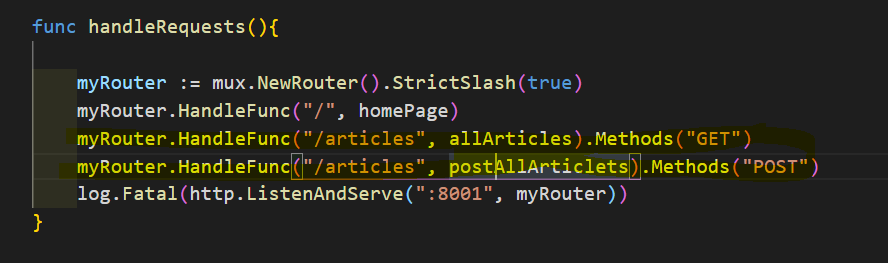

## [Jump to main page](./main.md)

# Restful API

- each handler is a function that takes in `responseWriter` and `request`, just like app.get() node.js
  - ```
    function example(w http.ResponseWriter, r *http.Request){}
    ```
- Use of `github.com/gorilla/mux` package
  - this allows an easier manipulation of accessing endpoints
  - As shown you can test same route with different rest methods when using api testers like Postman or Insomnia
    - 
- Use of `Gin`, which is a high-performance HTTP web framework written in Golang (Go)

---

## [Jump to main page](./main.md)
