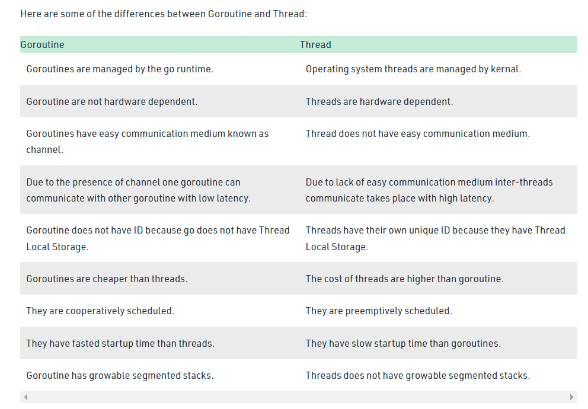

# Review on concurency / threading / parallelism

- [Review on concurency / threading / parallelism](#review-on-concurency--threading--parallelism)
- [Credits & resources](#credits--resources)
- [Where does threading come from? - limitation of # of CPU cores](#where-does-threading-come-from---limitation-of--of-cpu-cores)
- [Other notes](#other-notes)

# Credits & resources

- [video by Tech With Tim](https://www.youtube.com/watch?v=olYdb0DdGtM)
- [this webpage](https://www.iitk.ac.in/esc101/05Aug/tutorial/essential/TOC.html#threads) covers threading in Java in depth. Will take notes in other places regarding Java threading
- [Geeks for geeks](https://www.geeksforgeeks.org/golang-goroutine-vs-thread/)

# Where does threading come from? - limitation of # of CPU cores

- the compuer has CPU and core. The # of core you have on a processor is the # of **parallel operations** you can do at the same time
  - e.g. if you have 4 cores, you can do at most 4 operations at one time
- Each core has a running rate. E.g. 2.6ghz
  - It means that each second one core is able to do 2.6m operations per second
- Because of this limitation, thread is **a set of operations that needs to happen according on a schedule**
  - Each thread is assigned to a core
- We can run 4 threads at once, we are just changing the orders that we do specific operations
  - Threads can be hanged; one can be waiting for the other processings to happen
- **Concurrent programming**: doing things in different sequences

# Other notes

- Every program that executes on your system is a process and to run the code inside the application a process uses a term known as a thread.
- A thread is a **lightweight** process, or in other words, a thread is a unit which executes the code under the program. So every program has logic and a thread is responsible for executing this logic.
  - _a thread is considered lightweight because it runs within the context of a full-blown program and takes advantage of the resources allocated for that program and the program’s environment._
- There are some differences between Goroutine and threading:
  - 
