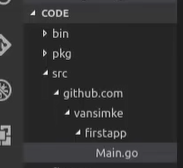

# Table of Content

- [Table of Content](#table-of-content)
- [Credit](#credit)
- [Jumpy to notes](#jumpy-to-notes)
  - [Basics](#basics)
  - [Something _\*special\*_ about Go](#something-special-about-go)
  - [Restful API](#restful-api)
- [Running and package](#running-and-package)
- [Random notes](#random-notes)

# Credit

- Constantly referencing to [go.dev](https://go.dev/)
- Following [this awsome youtube tutorial by freeCodeCamp](https://www.youtube.com/watch?v=YS4e4q9oBaU&t=4752s) for the basics of golang
  - [also looked into this video for interface](https://www.youtube.com/watch?v=gfoVLXQ5ujM)
- RestfulAPI:
  - [TutorialEdge](https://www.youtube.com/watch?v=W5b64DXeP0o&t=270s) for Example1
  - [Traversy Media](https://www.youtube.com/watch?v=SonwZ6MF5BE) for Example2
  - [go.dev for RESTful APi](https://go.dev/doc/tutorial/web-service-gin)

# Jumpy to notes

## Basics

- [Primitive Types and Variables](./Basic-part1-primitive-types-and-var.md)
- [Collections](./Basic-part2-collections.md)
- [Conditions and Logics](./Basic-part3-conditional-and-logical.md)
- [Pointers](./Basic-part4-pointers.md)

## Something _\*special\*_ about Go

- [Function Flow Control](./Function-Control.md)
- [Interface](./Interface.md)
- [(Before Goroutine) Review on Threading](./Threading.md)
- [Goroutines](./Goroutines.md)
- [Channels](./Channels.md)

## Restful API

- [Restful API](./RestfulApi.md)
- [Code for Restful API](./RestfulApi_code/main.go)

# Running and package

- basic structure recommended:

  - contains bin, pkg and src
  - 

- `go run PATH/\*.go`
  - compile temporarily and run
- `go build PACKAGE_PATH`
  - if found a main function & it will give an executable
- `go install`
  - expected to point to a package tat has an entry point, and install that executable into the bin folder

---

# Random notes

- go accepts \`string\` using back ticks, and we can use `""` inside the back ticks
- printf() substituters
  - `%v` value
  - `%t` type
  - `%p` pointer (will print out address)
- There are no function overloading or default values for arguments, and it's by design
- There is no generic types so repetition is possible
- Error handling can be annoying
- Everything in Go is passed by value: `passing an int value to a function makes a copy of the int, and passing a pointer value makes a copy of the pointer, but not the data it points to.`
- Official tutorial: [Effective Go](https://go.dev/doc/effective_go)
- This is an interesting read about the motivation of designs: [Go FAQ](https://go.dev/doc/faq)
